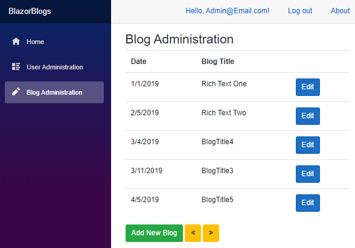
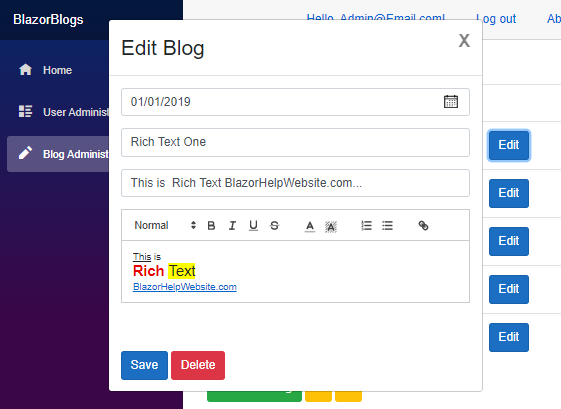

# Blazor-Blogs
Simple blogging application written in Microsoft Server Side Blazor

### Installing

1) Create Database and run scripts in !SQL directory
2) Edit *appsettings.json* to set the database connection and the user name and password of the Administrator
3) Run the application, click the *Register* link and create a user that matches the user name and password
4) Log out and log back in. You will now be the Administrator 

Uses [Blazored.TextEditor - Rich Text Editor for Blazor applications](https://github.com/Blazored/TextEditor "BlazorHelpWebsite.com")
