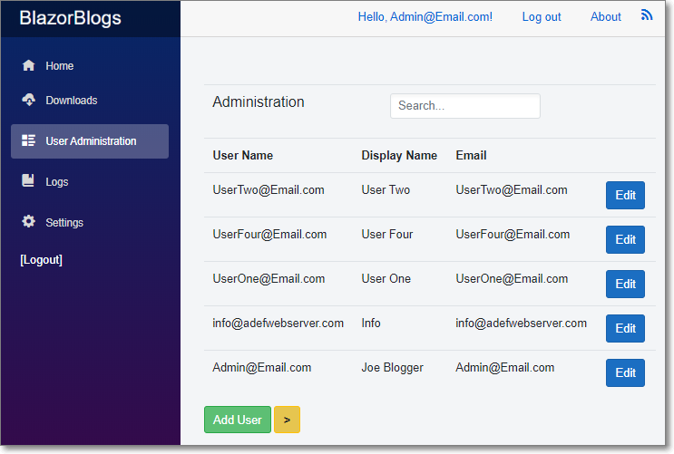

# Blazor-Blogs
Simple blogging application written in Microsoft Server Side Blazor

### Features

* Supports unlimited Bloggers
* Rich Text Editor with image uploads 
* Disqus integration for Blog post comments
* User Administration and role management
* User Registration with Email Verification and Password Resets
* File Download Page
* Custom Privacy Statement and Terms Of Use
* Dynamic Header and Logo
* Unlimited Tags for Blog Posts
* RSS Feeds

### Installing

1) Create Database and run scripts in !SQL directory
2) Edit *appsettings.json* to set the database connection and the user name and password of the Administrator
3) Run the application, click the *Register* link and create a user that matches the user name and password
4) Log out and log back in. You will now be the Administrator 

### Helpful Articles

* [Uploading Images With The Blazor Rich Text Editor](http://blazorhelpwebsite.com/Blog/tabid/61/EntryId/4369/Uploading-Images-With-The-Blazor-Rich-Text-Editor.aspx "BlazorHelpWebsite.com")
* [Creating Reusable Custom Blazor Controls](http://blazorhelpwebsite.com/Blog/tabid/61/EntryId/4365/Creating-Reusable-Custom-Blazor-Controls.aspx "BlazorHelpWebsite.com")
* [Creating A Rich Text Editor In Blazor Using Quill](http://blazorhelpwebsite.com/Blog/tabid/61/EntryId/4364/Creating-A-Rich-Text-Editor-In-Blazor-Using-Quill.aspx "BlazorHelpWebsite.com")

Uses [Blazored.TextEditor - Rich Text Editor for Blazor applications](https://github.com/Blazored/TextEditor "BlazorHelpWebsite.com")
