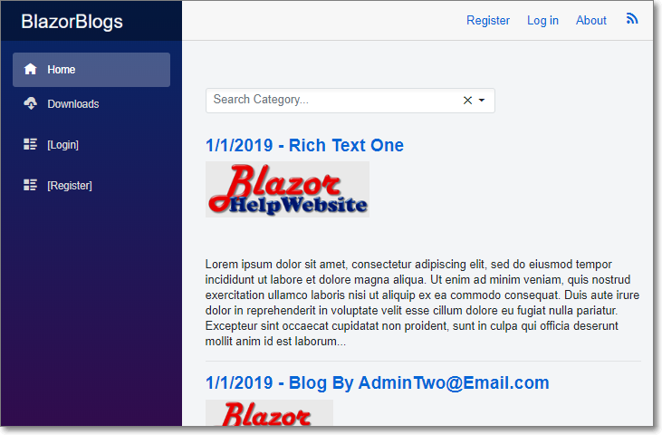
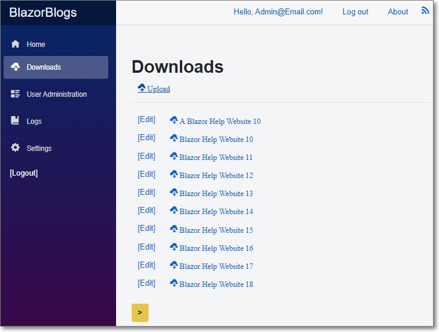

# Blazor-Blogs
#### Simple blogging application written in Microsoft Server Side Blazor

See: [Installing Blazor-Blogs on Microsoft Azure (Deploy To Azure Button Method)](https://blazorblogs.azurewebsites.net/ViewBlogPost/1008 "Installing Blazor-Blogs on Microsoft Azure")

## Live example site: https://blazorblogs.azurewebsites.net
#### Also see: [Installing Blazor-Blogs on Microsoft Azure (Manual Method)](https://blazorblogs.azurewebsites.net/ViewBlogPost/1007 "Installing Blazor-Blogs on Microsoft Azure")

### Features

* Supports unlimited Bloggers
* Rich Text Editor with image uploads 
* [Open Live Writer and Windows Live Writer support](https://blazorblogs.azurewebsites.net/ViewBlogPost/1005)
* [Disqus integration for Blog post comments](https://blazorblogs.azurewebsites.net/ViewBlogPost/1004)
* User Administration and role management
* User Registration with Email Verification and Password Resets
* File Download Page
* Custom Privacy Statement and Terms Of Use
* Dynamic Header and Logo
* Unlimited Tags for Blog Posts
* RSS Feeds

### Installing

1) Create a Database
2) Deploy the code to Azure or IIS
3) Run the application by navigating to the root page in the web browser
4) The Install Wizard will show and guide you though installing the application

### Helpful Articles

* [Installing Blazor-Blogs on Microsoft Azure (Deploy To Azure Button Method)](https://blazorblogs.azurewebsites.net/ViewBlogPost/1008 "Installing Blazor-Blogs on Microsoft Azure")
* [Installing Blazor-Blogs on Microsoft Azure (Manual Method)](https://blazorblogs.azurewebsites.net/ViewBlogPost/1007 "Installing Blazor-Blogs on Microsoft Azure")
* [Upgrading Blazor Blogs](https://blazorblogs.azurewebsites.net/ViewBlogPost/1011 "Upgrading Blazor Blogs")
* [Upgrading Blazor Blogs (Version 1.0 to Version 2.0)](https://blazorblogs.azurewebsites.net/ViewBlogPost/1013)
* [Uploading Images With The Blazor Rich Text Editor](https://blazorhelpwebsite.com/ViewBlogPost/7 "Uploading Images With The Blazor Rich Text Editor")
* [Creating Reusable Custom Blazor Controls](https://blazorhelpwebsite.com/ViewBlogPost/11 "Creating Reusable Custom Blazor Controls")
* [Creating A Rich Text Editor In Blazor Using Quill](https://blazorhelpwebsite.com/ViewBlogPost/12 "Creating A Rich Text Editor In Blazor Using Quill")
* [Importing Blogs From DotNetNuke Blogs](https://blazorblogs.azurewebsites.net/ViewBlogPost/1012 "Importing Blogs From DotNetNuke Blogs")

Uses [Blazored.TextEditor - Rich Text Editor for Blazor applications](https://github.com/Blazored/TextEditor "Blazored.TextEditor - Rich Text Editor for Blazor applications")
